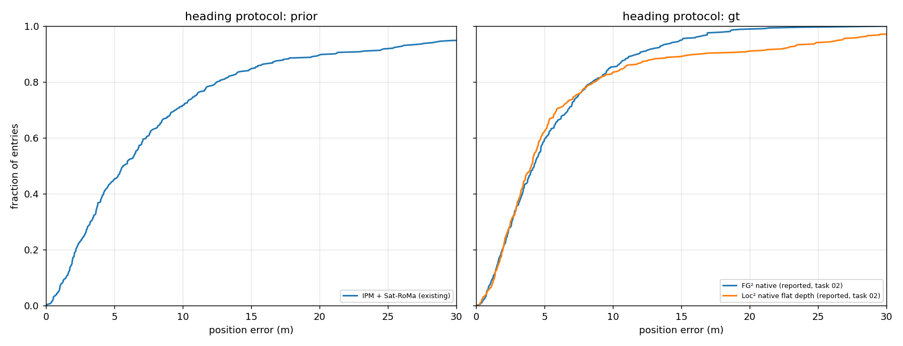

# Poznań three-way comparison: IPM + Sat-RoMa, FG², Loc², PanoRoMa

Written by `make poznan-three-way` (scripts/report_poznan_three_way.py). Manifest `experiments/06_fg2_bevsplat/manifest.json`, years [2025, 2024]: 200 held-out frames of route IcRzj × 2 orthophoto years; reference = the manifest's crop (224 m at 0.25 m/px for IPM; each method's native extent) centred within ±22 m of the position proxy, zero-shot everywhere. Error = distance to the Mapillary pose proxy (not survey GT). Median with 95 % bootstrap interval, mean capped at 1 km, recalls over all entries (failures count as misses), heading error median over the entries with a pose.

Heading protocols: **prior** = the panorama is oriented by the manifest's noisy heading (crop_up, U(−10°, 10°) off the proxy) and the method must recover the rest (what the IPM row always did); **gt** = oriented by the proxy heading itself (what the reported FG² / Loc² 'native' rows did: their panorama was rolled by crop_rot_deg, which uses the true heading).

## Protocol `prior`

| method | year | n | median m (95 % CI) | mean m | R@1 | R@5 | R@10 | > 30 m | heading median ° |
|---|---|---|---|---|---|---|---|---|---|
| IPM + Sat-RoMa (existing) | all | 400 | 5.69 (4.94–6.54) | 11.61 | 0.06 | 0.45 | 0.71 | 0.05 | 2.6 |
| IPM + Sat-RoMa (existing) | 2024 | 200 | 5.95 (4.77–6.67) | 14.24 | 0.06 | 0.45 | 0.71 | 0.05 | 2.5 |
| IPM + Sat-RoMa (existing) | 2025 | 200 | 5.51 (4.34–6.85) | 8.98 | 0.06 | 0.46 | 0.72 | 0.06 | 2.7 |

## Protocol `gt`

| method | year | n | median m (95 % CI) | mean m | R@1 | R@5 | R@10 | > 30 m | heading median ° |
|---|---|---|---|---|---|---|---|---|---|
| FG² native (reported, task 02) | all | 400 | 4.24 (3.79–4.61) | 5.57 | 0.07 | 0.59 | 0.85 | 0.00 | – |
| FG² native (reported, task 02) | 2024 | 200 | 3.95 (3.35–4.71) | 5.59 | 0.07 | 0.60 | 0.84 | 0.01 | – |
| FG² native (reported, task 02) | 2025 | 200 | 4.35 (3.82–4.90) | 5.56 | 0.07 | 0.58 | 0.86 | 0.00 | – |
| Loc² native flat depth (reported, task 02) | all | 400 | 4.03 (3.58–4.35) | 6.77 | 0.06 | 0.62 | 0.83 | 0.03 | – |
| Loc² native flat depth (reported, task 02) | 2024 | 200 | 3.67 (3.33–4.19) | 6.68 | 0.06 | 0.65 | 0.83 | 0.03 | – |
| Loc² native flat depth (reported, task 02) | 2025 | 200 | 4.21 (3.61–4.69) | 6.86 | 0.07 | 0.60 | 0.83 | 0.03 | – |

## Entry identity

Every row is on the same (frame id, year) entries.

## Not run yet

fg2_prior, loc2_flat_prior, loc2_unik3d_prior, fg2_gt, loc2_flat_gt, loc2_unik3d_gt, panoroma_prior_north, panoroma_gt_north

## Error CDF

