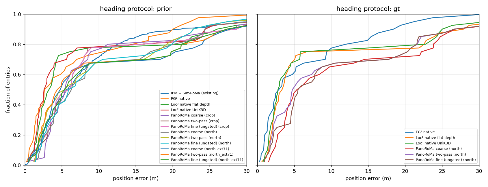

# Poznań three-way comparison: IPM + Sat-RoMa, FG², Loc², PanoRoMa

Written by `make poznan-three-way` (scripts/report_poznan_three_way.py). Manifest `experiments/06_fg2_bevsplat/manifest.json`, years [2025, 2024]: 200 held-out frames of route IcRzj × 2 orthophoto years; reference = the manifest's crop (224 m at 0.25 m/px for IPM; each method's native extent) centred within ±22 m of the position proxy, zero-shot everywhere. Error = distance to the Mapillary pose proxy (not survey GT). Median with 95 % bootstrap interval, mean capped at 1 km, recalls over all entries (failures count as misses), heading error median over the entries with a pose.

Heading protocols: **prior** = the panorama is oriented by the manifest's noisy heading (crop_up, U(−10°, 10°) off the proxy) and the method must recover the rest (what the IPM row always did); **gt** = oriented by the proxy heading itself (what the reported FG² / Loc² 'native' rows did: their panorama was rolled by crop_rot_deg, which uses the true heading).

## Protocol `prior`

| method | year | n | median m (95 % CI) | mean m | R@1 | R@5 | R@10 | > 30 m | heading median ° |
|---|---|---|---|---|---|---|---|---|---|
| IPM + Sat-RoMa (existing) | all | 400 | 5.69 (4.94–6.54) | 11.61 | 0.06 | 0.45 | 0.71 | 0.05 | 2.6 |
| IPM + Sat-RoMa (existing) | 2024 | 200 | 5.95 (4.77–6.67) | 14.24 | 0.06 | 0.45 | 0.71 | 0.05 | 2.5 |
| IPM + Sat-RoMa (existing) | 2025 | 200 | 5.51 (4.34–6.85) | 8.98 | 0.06 | 0.46 | 0.72 | 0.06 | 2.7 |
| FG² native | all | 40 | 2.91 (1.87–6.06) | 7.20 | 0.12 | 0.60 | 0.72 | 0.03 | 2.7 |
| FG² native | 2024 | 20 | 3.10 (1.68–6.55) | 7.76 | 0.15 | 0.60 | 0.75 | 0.05 | 2.7 |
| FG² native | 2025 | 20 | 2.91 (1.40–8.47) | 6.65 | 0.10 | 0.60 | 0.70 | 0.00 | 2.7 |
| Loc² native flat depth | all | 40 | 3.40 (2.20–4.09) | 8.64 | 0.07 | 0.72 | 0.78 | 0.07 | 1.7 |
| Loc² native flat depth | 2024 | 20 | 3.61 (2.22–4.12) | 8.57 | 0.05 | 0.80 | 0.80 | 0.10 | 2.1 |
| Loc² native flat depth | 2025 | 20 | 2.91 (1.67–7.31) | 8.71 | 0.10 | 0.65 | 0.75 | 0.05 | 1.5 |
| Loc² native UniK3D | all | 40 | 2.70 (1.96–3.92) | 8.46 | 0.07 | 0.68 | 0.78 | 0.07 | 3.0 |
| Loc² native UniK3D | 2024 | 20 | 3.35 (2.05–6.82) | 9.37 | 0.00 | 0.65 | 0.75 | 0.10 | 2.8 |
| Loc² native UniK3D | 2025 | 20 | 2.49 (1.53–4.32) | 7.55 | 0.15 | 0.70 | 0.80 | 0.05 | 3.2 |
| PanoRoMa coarse (crop) | all | 40 | 5.44 (4.41–7.56) | 10.10 | 0.03 | 0.42 | 0.75 | 0.07 | 7.9 |
| PanoRoMa coarse (crop) | 2024 | 20 | 5.75 (4.41–9.49) | 10.32 | 0.00 | 0.40 | 0.70 | 0.05 | 7.9 |
| PanoRoMa coarse (crop) | 2025 | 20 | 5.44 (3.51–7.06) | 9.89 | 0.05 | 0.45 | 0.80 | 0.10 | 8.3 |
| PanoRoMa two-pass (crop) | all | 40 | 6.12 (4.10–7.34) | 10.19 | 0.00 | 0.47 | 0.78 | 0.07 | 5.9 |
| PanoRoMa two-pass (crop) | 2024 | 20 | 5.46 (3.56–8.25) | 10.10 | 0.00 | 0.50 | 0.75 | 0.10 | 8.6 |
| PanoRoMa two-pass (crop) | 2025 | 20 | 6.29 (3.78–7.85) | 10.29 | 0.00 | 0.45 | 0.80 | 0.05 | 4.2 |
| PanoRoMa fine (ungated) (crop) | all | 40 | 6.12 (4.05–7.34) | 10.13 | 0.00 | 0.47 | 0.78 | 0.07 | 5.1 |
| PanoRoMa fine (ungated) (crop) | 2024 | 20 | 5.46 (3.05–8.46) | 9.98 | 0.00 | 0.50 | 0.75 | 0.10 | 7.9 |
| PanoRoMa fine (ungated) (crop) | 2025 | 20 | 6.29 (3.78–7.85) | 10.29 | 0.00 | 0.45 | 0.80 | 0.05 | 4.2 |
| PanoRoMa coarse (north) | all | 40 | 6.36 (4.07–8.58) | 10.85 | 0.00 | 0.40 | 0.68 | 0.07 | 5.8 |
| PanoRoMa coarse (north) | 2024 | 20 | 5.97 (3.87–8.58) | 9.40 | 0.00 | 0.40 | 0.75 | 0.05 | 5.8 |
| PanoRoMa coarse (north) | 2025 | 20 | 7.26 (3.89–17.41) | 12.31 | 0.00 | 0.40 | 0.60 | 0.10 | 5.4 |
| PanoRoMa two-pass (north) | all | 40 | 5.62 (3.09–9.27) | 10.22 | 0.00 | 0.47 | 0.68 | 0.05 | 3.5 |
| PanoRoMa two-pass (north) | 2024 | 20 | 5.58 (2.58–8.78) | 9.13 | 0.00 | 0.50 | 0.75 | 0.05 | 4.1 |
| PanoRoMa two-pass (north) | 2025 | 20 | 5.62 (2.91–18.07) | 11.32 | 0.00 | 0.45 | 0.60 | 0.05 | 3.5 |
| PanoRoMa fine (ungated) (north) | all | 40 | 6.38 (4.38–9.27) | 10.36 | 0.00 | 0.40 | 0.68 | 0.05 | 4.4 |
| PanoRoMa fine (ungated) (north) | 2024 | 20 | 6.89 (3.93–8.78) | 9.94 | 0.00 | 0.40 | 0.75 | 0.05 | 4.4 |
| PanoRoMa fine (ungated) (north) | 2025 | 20 | 5.71 (3.46–16.86) | 10.78 | 0.00 | 0.40 | 0.60 | 0.05 | 4.5 |
| PanoRoMa coarse (north_ext71) | all | 40 | 4.89 (3.52–8.33) | 11.55 | 0.05 | 0.53 | 0.68 | 0.10 | 6.9 |
| PanoRoMa coarse (north_ext71) | 2024 | 20 | 4.89 (3.37–18.90) | 11.17 | 0.05 | 0.55 | 0.65 | 0.05 | 7.1 |
| PanoRoMa coarse (north_ext71) | 2025 | 20 | 4.59 (2.76–16.47) | 11.92 | 0.05 | 0.50 | 0.70 | 0.15 | 6.1 |
| PanoRoMa two-pass (north_ext71) | all | 40 | 4.64 (2.96–8.03) | 11.02 | 0.05 | 0.55 | 0.68 | 0.10 | 5.2 |
| PanoRoMa two-pass (north_ext71) | 2024 | 20 | 4.23 (2.83–16.65) | 11.36 | 0.00 | 0.55 | 0.65 | 0.10 | 4.7 |
| PanoRoMa two-pass (north_ext71) | 2025 | 20 | 4.95 (2.10–13.13) | 10.69 | 0.10 | 0.55 | 0.70 | 0.10 | 6.3 |
| PanoRoMa fine (ungated) (north_ext71) | all | 40 | 5.55 (3.82–8.95) | 11.22 | 0.05 | 0.47 | 0.68 | 0.10 | 5.2 |
| PanoRoMa fine (ungated) (north_ext71) | 2024 | 20 | 6.36 (3.71–16.65) | 11.70 | 0.00 | 0.45 | 0.65 | 0.10 | 5.2 |
| PanoRoMa fine (ungated) (north_ext71) | 2025 | 20 | 5.16 (2.50–13.81) | 10.73 | 0.10 | 0.50 | 0.70 | 0.10 | 5.6 |

## Protocol `gt`

| method | year | n | median m (95 % CI) | mean m | R@1 | R@5 | R@10 | > 30 m | heading median ° |
|---|---|---|---|---|---|---|---|---|---|
| FG² native | all | 40 | 3.10 (1.88–5.73) | 6.79 | 0.20 | 0.60 | 0.75 | 0.03 | 3.3 |
| FG² native | 2024 | 20 | 2.90 (1.60–7.28) | 7.27 | 0.20 | 0.60 | 0.75 | 0.05 | 3.1 |
| FG² native | 2025 | 20 | 3.13 (1.52–9.19) | 6.31 | 0.20 | 0.60 | 0.75 | 0.00 | 3.5 |
| Loc² native flat depth | all | 40 | 3.44 (2.34–4.23) | 9.26 | 0.03 | 0.68 | 0.75 | 0.07 | 2.5 |
| Loc² native flat depth | 2024 | 20 | 3.70 (2.14–4.59) | 8.90 | 0.05 | 0.70 | 0.80 | 0.10 | 2.8 |
| Loc² native flat depth | 2025 | 20 | 2.91 (2.15–14.28) | 9.63 | 0.00 | 0.65 | 0.70 | 0.05 | 2.3 |
| Loc² native UniK3D | all | 40 | 2.88 (2.23–4.42) | 8.83 | 0.05 | 0.68 | 0.75 | 0.07 | 2.1 |
| Loc² native UniK3D | 2024 | 20 | 3.44 (2.40–5.76) | 9.37 | 0.00 | 0.65 | 0.75 | 0.10 | 2.2 |
| Loc² native UniK3D | 2025 | 20 | 2.59 (1.64–5.17) | 8.29 | 0.10 | 0.70 | 0.75 | 0.05 | 2.1 |
| PanoRoMa coarse (north) | all | 40 | 5.70 (4.00–11.41) | 12.20 | 0.00 | 0.47 | 0.65 | 0.10 | 5.0 |
| PanoRoMa coarse (north) | 2024 | 20 | 6.79 (3.98–13.79) | 11.77 | 0.00 | 0.40 | 0.65 | 0.10 | 7.3 |
| PanoRoMa coarse (north) | 2025 | 20 | 4.86 (3.83–23.29) | 12.64 | 0.00 | 0.55 | 0.65 | 0.10 | 3.9 |
| PanoRoMa two-pass (north) | all | 40 | 4.92 (3.69–9.63) | 11.46 | 0.03 | 0.50 | 0.65 | 0.10 | 2.8 |
| PanoRoMa two-pass (north) | 2024 | 20 | 5.98 (2.97–14.13) | 11.35 | 0.05 | 0.50 | 0.65 | 0.10 | 3.7 |
| PanoRoMa two-pass (north) | 2025 | 20 | 4.92 (2.56–20.54) | 11.57 | 0.00 | 0.50 | 0.65 | 0.10 | 2.7 |
| PanoRoMa fine (ungated) (north) | all | 40 | 5.71 (4.68–9.63) | 11.89 | 0.03 | 0.42 | 0.65 | 0.10 | 3.4 |
| PanoRoMa fine (ungated) (north) | 2024 | 20 | 7.55 (4.62–14.13) | 11.92 | 0.05 | 0.40 | 0.65 | 0.10 | 4.2 |
| PanoRoMa fine (ungated) (north) | 2025 | 20 | 5.27 (3.60–20.54) | 11.86 | 0.00 | 0.45 | 0.65 | 0.10 | 2.8 |

## Entry identity

Rows NOT on the reference entry set: FG² native/prior, Loc² native flat depth/prior, Loc² native UniK3D/prior, PanoRoMa coarse (crop)/prior, PanoRoMa two-pass (crop)/prior, PanoRoMa fine (ungated) (crop)/prior, PanoRoMa coarse (north)/prior, PanoRoMa two-pass (north)/prior, PanoRoMa fine (ungated) (north)/prior, PanoRoMa coarse (north_ext71)/prior, PanoRoMa two-pass (north_ext71)/prior, PanoRoMa fine (ungated) (north_ext71)/prior, FG² native/gt, Loc² native flat depth/gt, Loc² native UniK3D/gt, PanoRoMa coarse (north)/gt, PanoRoMa two-pass (north)/gt, PanoRoMa fine (ungated) (north)/gt

## UniK3D camera-height check

Implied camera height from road points [-20.0, -8.0]° below the horizon, ±30.0° fore/aft (20 panoramas, 0 restricted to Cityscapes road): median 1.63 m (p10 0.95, p90 2.10); flat-ground proxy of the reported Loc² row 1.65 m, IPM height 1.7 m.

## Error CDF

## Review note (2026-09-29)

The FG² rows above were decoded with p = −t (the task-02 decoding). FG²'s solver maps sat → ground (grd = R sat + t),
so the camera is at p = −Rᵀt; −t is exact only for R = I. `bevloc.baselines.fixtor.camera_in_sat` now uses −Rᵀt
(checked with FG²'s and Loc²'s own solvers on planted poses, tests/test_poznan_three_way.py). Re-decoding these
smoke rows exactly from their stored pred / yaw_r: FG² prior median 2.91 → 2.76 m (R@10 0.72 → 0.75), FG² gt
3.10 → 2.75 m (R@10 0.75 → 0.78); the transposed alternative is worse (3.62 / 3.35 m). Loc² (p = t) is unaffected.
